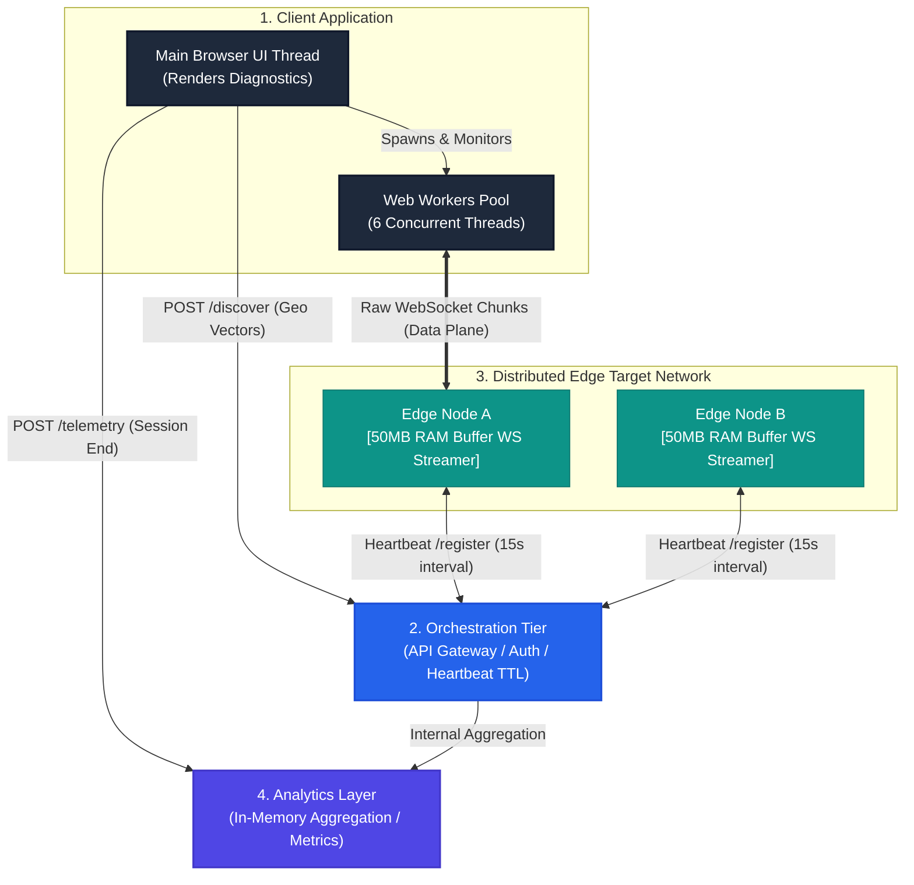

# Architecture: NT-Pulse v2

NT-Pulse is a production-grade, distributed real-time network throughput engine engineered in Node.js and TypeScript. Version 2 introduces a multi-threaded client execution model, an active health-checking Orchestration matrix, and a high-throughput WebSocket data plane. It isolates, measures, and calculates raw bandwidth metrics by eliminating platform overhead and transport layer initialization artifacts.

## 1. Core Mathematics

At its foundation, NT-Pulse measures **Bytes over Time ($B/t$)** during a state of total network link saturation, explicitly outputting network line capacity in **Megabits per second (Mbps)**.

$$\text{Throughput (Mbps)} = \frac{\text{Payload Size (Bytes)} \times 8}{\text{Sustained Window Time (Seconds)} \times 1,000,000}$$
_(Note: System implementation utilizes standard binary division $(1024 \times 1024)$ to accurately map Mebibits)_

- **The Numerator (bits):** Represents the actual network payload size transferred through the network card interface. Multiplying by 8 converts the payload from storage bytes to transmission bits.
- **The Denominator (Time):** Is strictly isolated to the steady-state tracking window where the TCP pipe is fully opened and saturated. This duration intentionally discards connection handshake latencies and initial window ramp-ups.

---

## 2. Architecture

---

## 3. Breakdown

### Multi-Threaded Client Engine

The client application is split across the UI and independent background threads to keep the main render cycle fluid and free from computation bottlenecks.

- **Responsibilities:**
- Parsing the client's local geolocation footprint via native browser APIs.
- Offloading concurrent network streaming to a dedicated Web Worker pool.
- Executing barrier synchronization to track total bytes across all independent threads.

- **Key Design Pattern: Web Worker Pool.** By spawning 6 concurrent background `Worker` threads, the client bypasses browser single-thread limitations, ensuring the CPU does not bottleneck the network interface card (NIC) when calculating incoming byte arrays.

### Orchestration Control Plane

A central API gateway that functions as the registry and authorization wall.

- **Responsibilities:**
- Validating active edge nodes via a strict 30-second Time-To-Live (TTL) pruning loop.
- Computing network topological distance using the Haversine formula to match the client with the absolute closest edge target.
- Generating cryptographically signed HMAC tokens (`exp`, `targetNode`) to prevent unauthorized data-plane saturation.

- **Key Design Pattern: Active Routing Matrix.** Separates the control plane from the data plane. The Orchestrator manages an elastic mesh of standalone Edge Nodes without ever touching the actual speed test payload.

### Distributed Edge Network

Minimal, hyper-optimized infrastructure instances.

- **Responsibilities:**
- Pinging the Orchestrator every 15 seconds to maintain active status in the routing matrix.
- Resolving their own public IP, geographic coordinates, and ISP via upstream localization providers upon boot.
- Streaming high-volume byte chunks down secure WebSocket pipes to authorized clients.

- **Key Design Pattern: Zero-Allocation RAM Buffers.** On boot, the server allocates a fixed-size `Buffer.allocUnsafe(50 * 1024 * 1024)` block inside system RAM. Incoming client streams read sequentially from this buffer in 64KB chunks using a zero-copy pointer loop. This completely bypasses disk I/O, isolating performance bottlenecks strictly to network transport limits.
- **The v2 Compatibility Pivot:** Initially designed for WebTransport over HTTP/3, the architecture utilizes raw WebSockets (`ws://`). This decision favors high-availability and library stability while mimicking WebTransport's low-overhead streaming characteristics by blasting unformatted binary chunks directly down the TCP pipe.

### Tier 4: The Analytics & Logging Layer

An out-of-band data engine designed to record and process telemetry tracking info.

- **Responsibilities:**
- Ingesting completed speed metrics logs (`/telemetry`) sent asynchronously from client sessions.
- Storing temporal session histories and global concurrency states to monitor overall infrastructure saturation.

---

## 4. Lifecycle

Whenever an NT-Pulse testing cycle is triggered, it transitions through five distinct sequential phases:

**`[1. Discovery]` ───> `[2. Allocation]` ────> `[3. Warmup]` ────> `[4. Active Sampling]` ────> `[5. Teardown]**`

### Phase 1: Geo-Discovery & Routing

The client requests hardware geolocation vectors and dispatches them via `POST` to the Orchestrator. The Orchestrator calculates the Haversine distance against all active nodes in its heartbeat registry and returns the optimal node alongside a time-restricted HMAC token.

### Phase 2: WebSocket Allocation

The client UI spawns the Web Worker pool. Each worker initiates a secure WebSocket connection directly to the Edge Node's Data Plane port, passing the HMAC token in the query string. The Edge Node verifies the cryptographic signature before opening the pipe. The current worker pool is defaulted to 6.

### Phase 3: Pipe Squeeze (TCP)

Once connected, the Edge Node begins blasting 64KB chunks of RAM buffer down the pipes. For the first initialization window, **all byte counters are ignored**. This gives the client-side environment and the OS transport layer time to scale up the TCP Congestion Window size to its maximum throughput capability.

### Phase 4: Active Sampling Window

The sampling boolean flags to `true`. The client starts a high-resolution microsecond timer (`performance.now()`). As binary packets arrive across all 6 concurrent worker sockets, their byte lengths are continuously appended to a central atomic counter via message passing. A decoupled interval calculates interim Mbps and passes real-time speed data to the UI.

### Phase 5: Teardown & Finalization

When the condition finishes, the main thread signals all active Web Workers to `.terminate()`, instantly severing the TCP pipes and freeing memory. Final throughput is calculated, rendered to the interface
