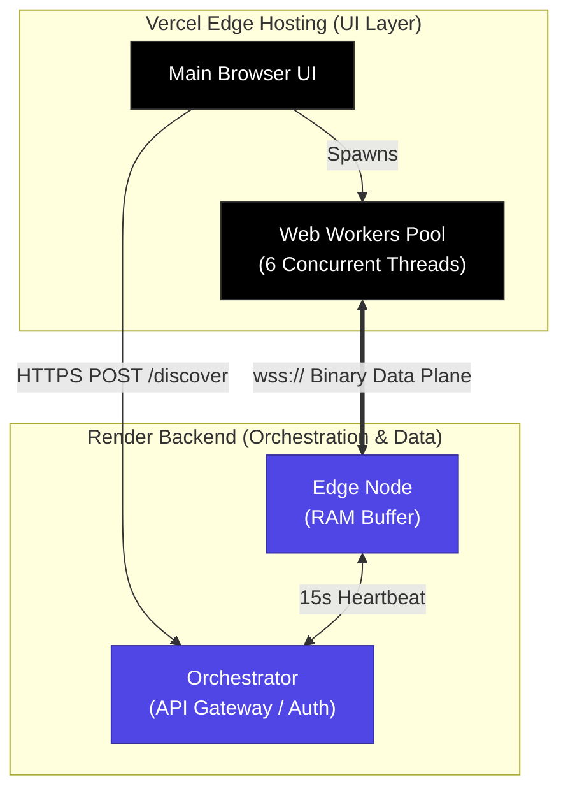

# Architecture: NT-Pulse v2.1

NT-Pulse is a distributed real-time network throughput engine. Version 2.1 enhances the architecture with a **hardened multi-tier deployment model**, utilizing **Vercel** for globally distributed frontend edge-delivery and **Render** for a resilient backend control plane.

## 1. Core Mathematics

At its foundation, NT-Pulse measures **Bytes over Time ($B/t$)** during a state of total network link saturation, explicitly outputting network line capacity in **Megabits per second (Mbps)**.

$$\text{Throughput (Mbps)} = \frac{\text{Payload Size (Bytes)} \times 8}{\text{Sustained Window Time (Seconds)} \times 1,000,000}$$

- **The Numerator (bits):** Represents the actual network payload size transferred through the interface.
- **The Denominator (Time):** Isolated to the steady-state tracking window where the TCP pipe is fully opened and saturated, discarding connection handshake latencies.

---

## 2. Updated Topology

---

## 3. Breakdown

### 1. Vercel Edge Frontend (The UI Layer)

The UI is now decoupled from the backend logic and deployed to Vercel’s global Edge Network.

- **Defensive Handshake Parsing:** The client implements robust response validation (handling 503/400 errors) to prevent runtime crashes during orchestration failures.
- **Protocol Enforcement:** Enforces `wss://` (Secure WebSockets). Since the frontend is served over HTTPS, all data-plane traffic is cryptographically wrapped to bypass browser "Mixed Content" security restrictions.

### 2. Orchestration Control Plane

The "brain" of the mesh, hosted on Render.

- **CORS & Origin Security:** The Orchestrator is configured to validate `Origin` headers, ensuring only your deployed Vercel domain can request discovery and telemetry ingestion.
- **Registry & TTL:** Maintains the active memory map. Enforces a 30-second TTL. The Orchestrator no longer just routes traffic; it actively monitors the health of the mesh via the heartbeat pulses.

### 3. Distributed Edge Network

The data plane, hosted on Render.

- **Zero-Allocation RAM Buffers:** Bootstraps with a fixed 50MB `Buffer.allocUnsafe()` to eliminate disk I/O latency.
- **Dynamic Re-registration:** Nodes perform self-discovery on boot, resolving public IPs and ISP metadata. They maintain a 15-second heartbeat interval to ensure the Orchestrator's routing matrix remains accurate.

---

## 4. Lifecycle: The v2.1 Handshake

Whenever an NT-Pulse testing cycle is triggered, it transitions through these 5 phases:

1. **[Discovery]:** Client fetches `https://nt-pulse-orchestrator.onrender.com/discover`. The Orchestrator validates the origin and computes a proximity-optimized node using the **Haversine Matrix**.
2. **[Handshake]:** Orchestrator issues a time-restricted HMAC-SHA256 token. The client parses this defensively; if the handshake fails, the UI reports a graceful error state rather than a crash.
3. **[Allocation]:** Client initializes 6 Web Workers. Each worker requests a connection using the secure `wss://` URI and the provided auth token.
4. **[Active Sampling]:** The "Pipe Squeeze" begins. The client counts raw byte arrivals across all 6 threads via atomic counters.
5. **[Teardown]:** Threads are terminated, the socket pipe is closed, and telemetry (Mbps) is asynchronously shipped to the Orchestrator's `/telemetry` endpoint.

---

## 5. Deployment Considerations

- **Environment Variable Integrity:** Ensure `GATEWAY_URL` is set in Vercel to point to the production Orchestrator URL.
- **CORS Headers:** The Orchestrator `Access-Control-Allow-Origin` header must be updated to include your production Vercel deployment URL to prevent handshake rejection.
- **WebSocket Security:** In production, do not revert to `ws://`. Always ensure the Edge Node is behind an SSL proxy (Render handles this natively) and the client connects via `wss://`.
